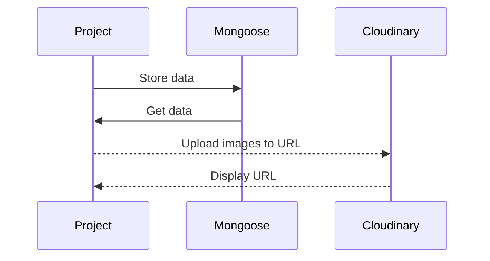

# Final Project

Upload and post images in specific locations.

## Getting Started

<!-- Link: https://aux-app.herokuapp.com/song -->

## ScreenShots

<!-- The home screen shows all of your songs added to the playlist

Clicking on a song will spin the record and "play" the song

Using the seach bar you can look for all music in the Dicogs API database

You can then add these songs to your playlist
Once a song is on your playlist you can remove or click the song title for more details

Depending on your mood you can filter using the slider
 -->

## Restful Routes

| RESTful Routes | HTML     | Verb   |
| -------------- | -------- | ------ |
| Index          | /        | GET    |
| New            | //:query | GET    |
| Delete         | //\_:id  | DELETE |
| Create         | /        | POST   |
| Show           | //:\_id  | GET    |

## Next Steps

Add in GoogleMaps API and connect each image to a location on the map

## Technology Used

<li>
MongoDB
express
JavaScript
TailWind
express-session
jsx-view-engine
Cloudinary
React
</li>

