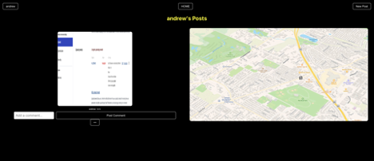
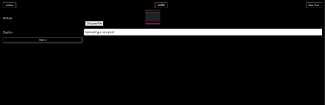
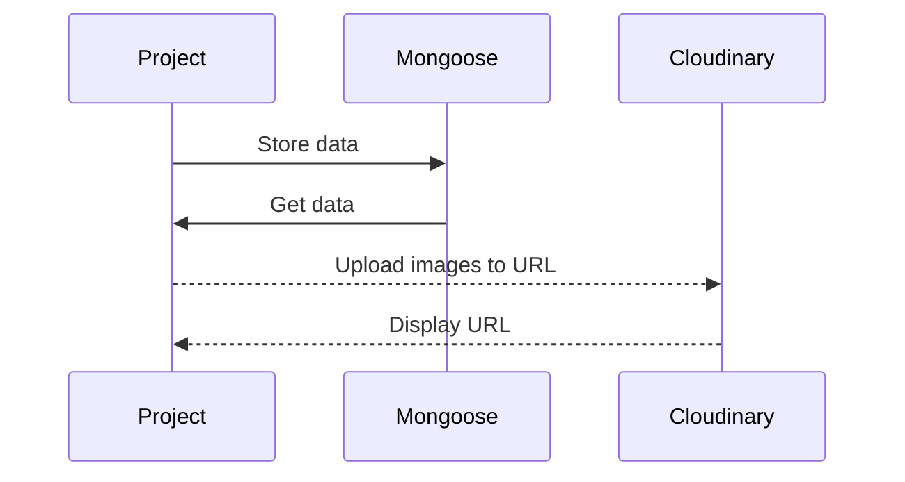

# Final Project

Upload and post images in specific locations.

## Getting Started

<!-- Link: https://aux-app.herokuapp.com/song -->

## ScreenShots

First lets Login/Sign Up

Then you'll be taken to the home page where you can see everyones images on the map

If you go to your page on the top navigation you will see only your posts and be able to delete posts there

To post a new post, go to post and upload an image and add a caption. Soon will be adding a location as well

## Restful Routes

| RESTful Routes | HTML     | Verb   |
| -------------- | -------- | ------ |
| Index          | /        | GET    |
| New            | //:query | GET    |
| Delete         | //\_:id  | DELETE |
| Create         | /        | POST   |
| Show           | //:\_id  | GET    |

## Next Steps

Add in GoogleMaps API and connect each image to a location on the map

## Technology Used

<li>
MongoDB
express
JavaScript
TailWind
express-session
jsx-view-engine
Cloudinary
React
</li>

